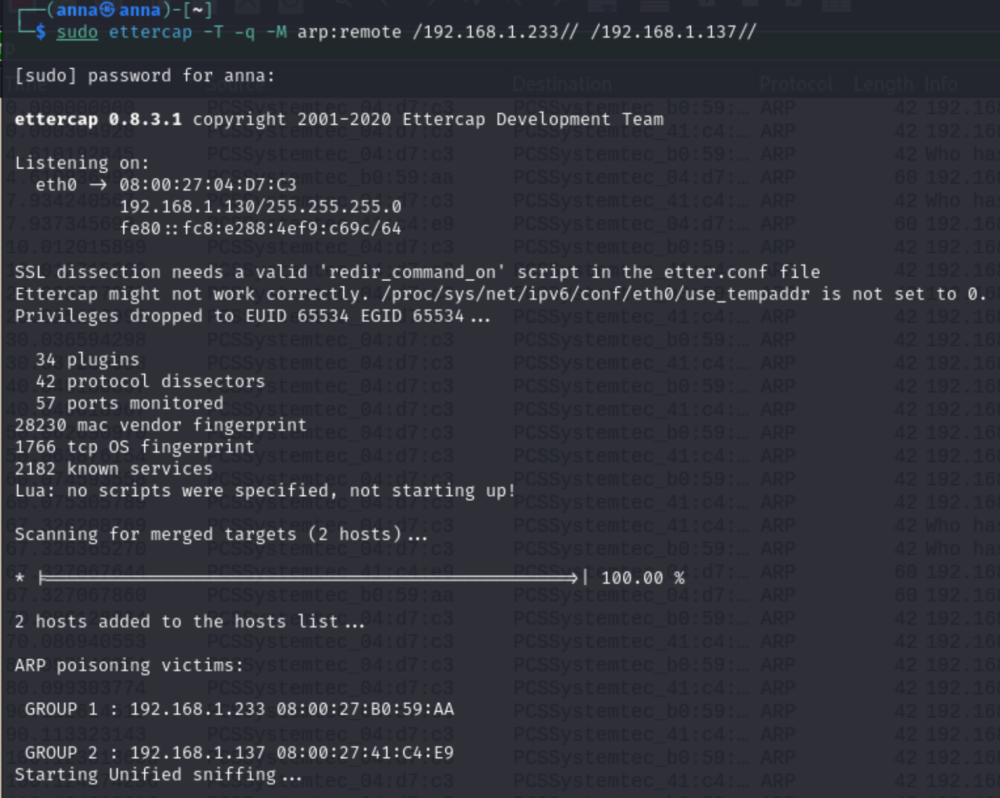

# Attacchi a Kerberos: AS-REP roasting e Password Cracking di AS-REQ

Report per il corso di Cybersecurity[446MI], Università degli Studi di Trieste

    
 Anna Pascali, IN2000235  

&nbsp;

## Introduzione 
Il presente elaborato è volto alla dimostrazione di un attacco a kerberos, in particolare verranno illustrati:
- AS-REP roasting 
- password cracking di AS-REQ (di un utente con preauthentication)

A tale scopo è stato creato il dominio "mynetwork.local" su una macchina virtuale su cui è stato installato Windows Server 2022. 

### Presentazione del Dominio 
Su windows server 2022 è stato installato e configurato Windows Active Directory Domain Services, DNS e DHCP. Utilizzando il DHCP ho assegnato indirizzi IP statici, all’interno di un range prefissato, ai nodi facenti parte dell’organizzazione. In particolare l’indirizzo IP del nodo su cui è presente il DC è 192.168.1.233; alla macchina con Windows 10 è stato assegnato l’indirizzo IP 192.168.1.137.  
Al dominio “mynetwork.local” appartengono vari utenti, alcuni dei quali fanno parte di gruppi. Di rilievo è, ad esempio, l’utente Mario, il cui account è stato configurato con “Do not require Kerberos preauthentication”. Questo assume particolare importanza per portare a termine il AS-REP roasting. Del dominio fanno parte anche altri utenti con pre authentication, uno dei quali eseguirà un interactive logon nella seconda parte della demo

_Figura 1: Account di Mario_ 

### Macchine Virtuali utilizzate
Per eseguire la demo verranno utilizzate 3 macchine virtuali:
- Una macchina su cui ho installato Windows Server 2022. Questo nodo svolge il ruolo di Domain Controller (= DC) per il dominio “mynetwork.local”, che è stato creato allo scopo di eseguire la demo. 
- Una macchina su cui ho installato Windows 10 for Workstations; fa parte del dominio che ho creato. È il nodo da cui un utente inserito nel dominio eseguirà interactive logon in questa demo. 
- Kali linux è la macchina a disposizione dell’attaccante.

### Threat Model
Il threat model che verrà adottato è il seguente. 
Si suppone che l’attaccante:
- abbia informazioni sulla struttura di rete, quindi conosca l'indirizzo IP del nodo su cui è presente il Domain Controller (DC) e il range degli indirizzi IP assegnati ai nodi appartenenti al dominio; 
- sia in grado di comunicare con le macchine del dominio, quindi possa aprire connessioni TCP con queste.

### Tool 
Breve panoramica dei tool utilizzati in questa demo. 
- per AS-REP roasting:
  -  GetNPUsers, che è uno script python incluso nel toolkit Impacket, una raccolta di classi python per lavorare con i protocolli di rete. Questo script verrà utilizzato per interrogare il DC su quali utenti non richiedono preauthentication e quindi chiedere un TGT a loro nome.
  - john the ripper per eseguire offline guessing. A partire dall'AS-REP, questo tool permette di ottenere la password dell’utente a cui è intestato il TGT. 

Quindi complessivamente grazie a questi due strumenti saremo in grado di venire a conoscenza di quali utenti non hanno preauthentication e una volta ottenuta la risposta del DC, criptata con la chiave che deriva dal hash della loro password, eseguire un password cracking ed ottenere di fatto la password di questi utenti. 

- Password Cracking di AS-REQ:
    - ettercap: permette di fare ARP spoofing, quindi diventare man in the middle a livello 2 del modello ISO/OSI.
    - wireshark: strumento che permette di analizzare il traffico di rete.
    - hashcat: permette di eseguire offline guessing
 
Grazie a questi strumenti siamo in grado di intercettare l'AS-REQ di un utente e montare un offline guessing attack per determinare la password di questo utente.

&nbsp;

## AS-REP roasting

### Contesto
Questo tipo di attacco ha come presupposto il fatto che all’interno del dominio preso in considerazione ci sia almeno un utente il cui account è configurato con “Do not require Kerberos preauthentication”. L’attaccante, interrogando il DC, viene a conoscenza di quali siano gli utenti che hanno questo tipo di configurazione, il che significa che per contattare l’AS, e ottenere un TGT, il loro AS-REQ non deve essere criptato con la chiave che deriva in maniera deterministica dal hash della loro password. Viene inviato un AS-REQ in chiaro e il DC risponderà con un AS-REP che contiene il TGT per quell’utente; la riposta del DC sarà criptata con la chiave dell’utente e costituisce guessing material per l’attaccante, che può eseguire un password cracking attack.
Ne consegue che chiunque sia in grado di contattare il DC può chiedere un TGT a nome di un utente che non richiede pre authentication, senza dover conoscere la sua password. Chiaramente questo è vantaggioso per l’attaccante perché se è in grado di contattare il DC, tramite GetNPUsers, può fornirgli una lista di username di potenziali utenti senza pre authentication e, se nella lista è presente lo username di un utente il cui account è davvero configurato in questo modo, il DC risponderà con un TGT per quell’utente. Quindi l’attaccante, una volta ricevuta la riposta del DC, che sarà criptata nella chiave dell’utente, può montare un offline guessing attack per trovare la password di questo. 

### Esecuzione dell’attacco
Per contattare il DC verrà utilizzato il comando Impacket-GetNPUsers. Per eseguire questo comando è necessario avere a disposizione un file di testo, in figura denominato names.txt, che contenga un elenco di potenziali username del dominio. L’idea è che lo script GetNPUsers chiederà al DC se gli username presenti nel file di testo hanno “Do not require Kerberos preauthentication” abilitato; in caso di risposta affermativa, il DC risponderà inviando un TGT a nome di questi utenti. Oltre al TGT, l’AS-REP contiene una parte criptata con la chiave dell’utente e questa verrà utilizzata per portare a termine il password cracking.
In figura si vede che l’utente Mario, appartenente al dominio MYNETWORK non richiede preauthentication. In particolare: 
krb5asrep indica che quanto segue è la parte crittografata di un AS-REP del protocollo Kerberos. Questo verrà utilizzato da john the ripper per sapere con quale formato calcolare l’hash delle password che gli passeremo, dall’hash poi in maniera deterministica si può ottenere la chiave.
23 indica che il tipo di crittografia utilizzata è RC4-HMAC.
ciò che segue “ : ” è la risposta del DC, criptata con la chiave di Mario

&nbsp;

_Figura 2: Esecuzione di GetNPUsers_

&nbsp;

Dalla figura inoltre si osserva che nel file names.txt erano presenti molti username che non corrispondono ad utenti registrati nel dominio; Giulio è uno username del dominio che richiede preauthentication.
La stringa ottenuta in riposta dal DC verrà salvata in un file di testo, denominato hash.asrep1 per chiarezza. 

Quindi verrà lanciato john the ripper, a cui vanno passati:
un file contenente ipotetiche password, qui denominato pwdComunit.txt
krb5asrep: il formato con cui calcolare l’hash; dal hash si trova la chiave. 
il documento contente il AS-REP criptato, che abbiamo chiamato hash.asrep1
john prenderà le password contenute nel file pwdComuni, usando i parametri specificati, relativi al formato e al tipo di crittografia, calcola l’hash di ogni password, da questa ricava la chiave e vede se è corretta per l’AS-REP criptato che gli abbiamo fornito. 

&nbsp;

_Figura 3: Esecuzione di john the ripper_

&nbsp;

Dalla figura si evince che l’esecuzione di john ha permesso di determinare che la password di Mario è “ciaoBelli!1”. Questo significa che questa password era presente nel file pwdComuni.txt che è stato passato al tool.

&nbsp;

## Password Cracking di AS-REQ:

### Contesto
Nell’ambito dell’autenticazione di un utente con il protocollo Kerberos, la workstation su cui un utente si vuole autenticare ed il nodo su cui è presente il domain controller si scambiano dei pacchetti volti a verificare se l’utente può essere autenticato su quella workstation. In particolare il primo messaggio inviato dalla workstation viene denominato AS-REQ, ovvero Authentication Service Request ed è criptato con la chiave dell’utente. 
L’obiettivo di questa parte di demo è intercettare l’AS-REQ di un utente inserito nel dominio mynetwork.local e montare un attacco di tipo password cracking per risalire alla password di tale utente. 

## Esecuzione dell’Attacco 
L’idea è quella di intercettare lo scambio di pacchetti fra il nodo su cui un utente si autenticherà e il nodo su cui è presente il DC. Per farlo occorre diventare Man In The Middle (MITM). Questo perché le macchine virtuali sono configurate per quanto riguarda la rete con “Internal Network”, quindi la rete viene gestita da uno “switch virtuale” e gli switch in generale utilizzano le tabelle di indirizzi MAC e lavorano inviando pacchetti solo alla porta che corrisponde all'indirizzo MAC del destinatario. Ne consegue che l’attaccante, restando all’esterno della comunicazione non riesce a vedere i pacchetti scambiati fra due nodi. Pertanto l’attaccante deve fare in modo che il traffico passi attraverso di lui. Ne deriva l’esigenza di diventare MITM. In questa demo l’attaccante diventerà MITM utilizzando ettercap, un tool di kali che permette di eseguire un ARP spoofing, quindi di diventare MITM a livello Ethernet. 
L’idea alla base del funzionamento di questo tool e dell’ARP spoofing è inviare messaggi ARP spoofed, cioè falsi, in modo che quando un nodo deve comunicare con il DC, l’attaccante ha associato il proprio indirizzo MAC all’indirizzo IP del nodo su cui è presente il DC quindi i pacchetti destinati a quest ultimo arrivano al nodo su cui sta l’attaccante; analogamente l’attaccante invia dei messaggi ARP spoofed per associare il proprio indirizzo MAC all’indirizzo IP del nodo su cui l’utente si sta autenticando, in modo che  quando il DC deve parlare con quel nodo,  il traffico passi attraverso l’attaccante.
È interessante osservare che qui torna utile l’ipotesi che l’attaccante conosca l’indirizzo IP del nodo su cui si trova il DC e il range degli indirizzi IP assegnati ai nodi dell’organizzazione. 

&nbsp;

_Figura 4: Esecuzione di ettercap_

&nbsp;

La figura rappresenta l’esecuzione di ettercap al fine di diventare MITM a livello Ethernet. Il presupposto è quello di conoscere l’indirizzo IP del nodo su cui sta il DC (qui 192.168.1.233) e di scegliere l’indirizzo IP di un nodo all’interno del range di indirizzi IP noti. L’attaccante intercetta il traffico fra questi due nodi e auspicabilmente un utente si collegherà al DC da quel nodo in particolare; se così non dovesse essere l’attaccante può scegliere un altro indirizzo IP e riprovare. 

In particolare è interessante osservare i veri indirizzi MAC delle due macchine.

&nbsp;

_Figura 5: Pacchetti ARP_ 

&nbsp;

192.168.1.137 è l’indirizzo IP della macchina Windows 10;  
192.168.1.233 è l’indirizzo IP del nodo su cui è presente il domain controller. 
Questa figura illustra lo scambio di pacchetti ARP che ha permesso all’attaccante di associare il proprio indirizzo MAC (quello di kali, che è la macchina da cui l’attaccante opera) ai due nodi: ne consegue che qualunque messaggio indirizzato a 192.168.1.137 verrà inviato a kali; analogamente qualunque messaggio indirizzato a 192.168.1.233 arriverà a kali.

Ora l’attaccante è diventato MITM fra il nodo su cui sta il DC e un nodo in particolare dell’organizzazione (cioè 192.168.1.137 ). Supponiamo ora che, su quel nodo, ci sia un utente (con pre authentication) che esegue un interactive logon. L’attaccante riesce ad intercettare lo scambio di pacchetti fra la workstation e il DC. Per farlo utilizzeremo wireshark, l’interfaccia di rete che intercettiamo è eth0, filtriamo utilizzando il protocollo kerberos, che è quello a cui siamo interessati.

&nbsp;

_Figura 6: Wireshark_

&nbsp;

In particolare, il messaggio a cui siamo interessati è AS-REQ, che, come indicato dalla figura, è il pacchetto che la workstation invia alla macchina con il DC. L’obiettivo di questa parte di demo è fare un offline guessing attack per ricavare la password dell’utente, del quale abbiamo intercettato l’AS-REQ.

Analizzando più nel dettaglio l’AS-REQ, le informazioni rilevanti per montare l’attacco sono: 
etype: il tipo di crittografia utilizzata, qui 18
cipher: il valore criptato
CNameString: lo username dell’utente che ha inviato l’AS-REQ
realm: dominio di cui fa parte questo utente
questi sono tutti parametri che ci serviranno per costruire la stringa da passare a hashcat che è il tool che verrà utilizzato per eseguire il password cracking. 

&nbsp;

_Figura 7: AS-REQ nel dettaglio_ 

&nbsp;

Per costruire la stringa da passare a hashcat si possono consultare degli esempi online, in particolare il formato corretto è quello indicato in figura: 

&nbsp;

_Figura 8: Esecuzione di hashcat_ 

&nbsp;

dove:
krb5pa è il formato con cui calcolare l’hash. Dall’hash, in maniera deterministica, si risale alla chiave 
18 è il tipo di crittografia utilizzata per generare il valore “cipher”
tecnico2 è lo username dell’utente di cui abbiamo intercettato AS-REQ
MYNETWORK.LOCAL è il dominio di cui l’utente fa parte

hashcat si aspetta anche un file di testo contenente alcune password, qui indicato con pwdComuni.txt. Il tool, utilizzando i parametri specificati relativamente a formato e tipo di crittografia, calcola l’hash per ogni password presente nella lista, da questo calcola la chiave e vede se è corretta per il messaggio intercettato. Se l’operazione va a buon fine, cioè se la chiave di “tecnico2” è presente nell’elenco passato, hashcat restituisce la password dell’utente, come si evince dalla figura seguente. 

&nbsp;

_Figura 7: Risultato dell'esecuzione di hashcat_ 

&nbsp;

