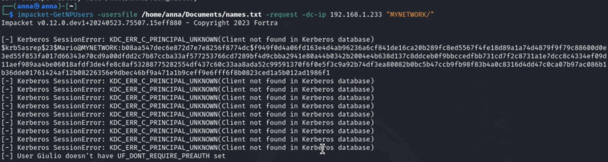

# Attacchi a Kerberos:   AS-REP roasting e Network Sniffing di AS-REQ + Password Cracking

Report per il corso di Cybersecurity [446MI], Università degli Studi di Trieste

    
 Anna Pascali, IN2000235 

    
 Trieste, 05.06.2024 

## Introduzione 
Il presente elaborato è volto alla dimostrazione di un attacco a kerberos, in particolare verranno illustrati:
- AS-REP roasting 
- Network Sniffing di AS-REQ e Password Cracking (per un utente con preauthentication)

A tale scopo è stato creato il dominio "mynetwork.local" su una macchina virtuale su cui è stato installato Windows Server 2022. 

### Macchine Virtuali utilizzate
Per eseguire la demo verranno utilizzate 3 macchine virtuali (VM - Virtual Machine):
- VM su cui ho installato Windows Server 2022. Questo nodo svolge il ruolo di Domain Controller (DC) per il dominio “mynetwork.local”, che è stato creato allo scopo di eseguire la demo. 
- VM su cui ho installato Windows 10 for Workstations; fa parte del dominio che ho creato. È il nodo da cui un utente inserito nel dominio eseguirà interactive logon in questa demo. 
- Kali linux è la macchina a disposizione dell’attaccante.

### Presentazione del Dominio 
Sulla VM con Windows Server 2022 è stato installato e configurato Windows Active Directory Domain Services. Inoltre ho installato e configurato i servizi DNS e DHCP. Utilizzando il DHCP ho assegnato indirizzi IP statici, all’interno di un range prefissato, ai nodi facenti parte dell’organizzazione. In particolare l’indirizzo IP del nodo su cui è presente il DC è 192.168.1.233; alla VM con Windows 10 è stato assegnato l’indirizzo IP 192.168.1.137.  
Al dominio “mynetwork.local” appartengono vari utenti, alcuni dei quali fanno parte di gruppi. Di rilievo è, ad esempio, l’utente Mario, il cui account è stato configurato con “Do not require Kerberos preauthentication”. Questo assume particolare importanza per portare a termine il AS-REP roasting. Del dominio fanno parte anche altri utenti con pre authentication, uno dei quali eseguirà un interactive logon nella seconda parte della demo.

### Threat Model
Il threat model che verrà adottato è il seguente. Si suppone che l’attaccante:
- abbia informazioni sulla struttura di rete, quindi conosca l'indirizzo IP del nodo su cui è presente il Domain Controller (DC) e il range degli indirizzi IP assegnati ai nodi appartenenti al dominio; 
- sia in grado di comunicare con le macchine del dominio, quindi possa aprire connessioni TCP con queste.

&nbsp;

## AS-REP roasting

### Contesto
Questo tipo di attacco ha come presupposto il fatto che all’interno del dominio preso in considerazione ci sia almeno un utente il cui account è configurato con “Do not require Kerberos preauthentication”. L’attaccante, interrogando il DC, viene a conoscenza di quali siano gli utenti che hanno questo tipo di configurazione, il che significa che per contattare l’Authentication Service (AS), e ottenere un TGT (Ticket Granting Ticket), il loro AS-REQ non deve essere criptato con la chiave che deriva in maniera deterministica dal hash della loro password. Viene inviato un AS-REQ in chiaro al DC, il quale risponderà con un AS-REP che contiene, oltre al TGT per quell’utente, una parte di messaggio criptata con la chiave dell’utente. Ne consegue che la risposta del DC costituisce guessing material e permette di eseguire un password cracking attack.

### Esecuzione dell’attacco
In questa demo verrà utilizzato lo script python GetNPUsers, che appartiene al toolkit Impacket (una raccolta di classi python per lavorare con i protocolli di rete). Tramite LDAP queries, GetNPUsers contatta il DC per verificare se gli username che passiamo in un file di testo corrispondono a utenti inseriti nel dominio considerato e, in particolare se, fra questi, qualcuno non richiede preauthentication. Una volta trovato un utente che soddisfi questi requisiti, lo script costruisce un AS-REQ a suo nome da inviare in chiaro al DC, il quale risponderà con un AS-REP contente il TGT e una parte di messaggio criptata nella chiave dell'utente. 

_Figura 2: Esecuzione e risultato di GetNPUsers_

Per eseguire questo comando è necessario:
- avere a disposizione un file di testo, in figura denominato names.txt, che contenga un elenco di potenziali username del dominio;
- scegliere un dominio, in figura indicato con MYNETWORK;
- conoscere l'indirizzo IP del nodo su cui è presente il DC, qui 192.168.1.233. Questo è reso possibile dal threat model adottato.

Dalla figura si vede che:
- molti degli utenti presenti in names.txt non fanno parte del dominio MYNETWORK;
- l'utente Giulio fa parte del dominio MYNETWORK e richiede preauthentication: per questo utente lo script non ha costruito un AS-REQ;
- l’utente Mario, appartenente al dominio MYNETWORK, non richiede preauthentication. Per lui è stato inviato un AS-REQ e in figura si vede la risposta del DC.
 
Analizziamo meglio la risposta del DC: "krb5asrep" è il formato con cui vengono rappresentati i dati di un AS-REP del protocollo Kerberos. "23" indica che il tipo di crittografia utilizzata è RC4-HMAC. Questo è interessante perché indica che GetNPUsers ha richiesto al DC che l'AS-REP venisse criptato utilizzando RC4, un algoritmo di crittografia più lento rispetto ad AES (algoritmo usato di default in kerberos). Grazie a questo, il cracking tool che useremo richiederà meno tempo per portare a termine il password cracking e quindi determinare la password dell'utente Mario.  
In quanto segue indicheremo, per compattezza di notazione, K_mario come la chiave dell'utente Mario.

Per eseguire il password cracking utilizziamo john the ripper (john). La stringa ottenuta in riposta dal DC verrà salvata in un file di testo, denominato hash.asrep1. Quindi verrà lanciato john, a cui passiamo:
- un file di testo contenente ipotetiche password, qui denominato pwdComunit.txt;
- krb5asrep: il formato con cui calcolare l’hash (poi dal hash si ottiene la chiave); 
- il file contente AS-REP criptato con K_mario, qui hash.asrep1

Il tool agirà nel modo seguente. Per ogni password (pwd) in pwdComuni.txt:
- calcola l’hash, H(pwd), usando i parametri specificati, relativi al formato e al tipo di crittografia;
- da H(pwd) ricava K_H(pwd);
- prova K_H(pwd) sul messaggio criptato e vede se è la chiave giusta, cioè se corrisponde a K_mario.

_Figura 3: Esecuzione di john the ripper_

Dalla figura si evince che l’esecuzione di john ha permesso di determinare che la password di Mario è “ciaoBelli!1”. Questo significa che questa password era presente nel file pwdComuni.txt che è stato passato al tool. K_mario è stata quindi ottenuta proprio a partire dall'hash di questa password.

In conclusione, da questa parte della demo si è visto come un attaccante che non conosceva la password di un utente inserito nel dominio mynetwork.local ha ottenuto, in risposta dal DC, un messaggio criptato con la chiave di questo utente. L'attaccante dunque, montando un password cracking attack, ha potuto determinare la sua password. 

&nbsp;

## Network Sniffing di AS-REQ + Password Cracking

### Contesto
Nell’ambito dell’autenticazione di un utente con il protocollo Kerberos, la workstation su cui l'utente ha inserito le credenziali scambia dei pacchetti con il nodo su cui è presente il DC con il protocollo Kerberos; tale scambio è volto a consentire o negare l'autenticazione di tale utente. In particolare il primo messaggio inviato dalla workstation viene denominato AS-REQ (Authentication Service Request) ed è criptato con la chiave dell’utente.  
L’obiettivo di questa parte di demo è intercettare l’AS-REQ di un utente inserito nel dominio mynetwork.local e montare un attacco di tipo password cracking per risalire alla password di tale utente. 

## Esecuzione dell’Attacco 
L’idea è quella di intercettare lo scambio di pacchetti fra il nodo su cui un utente si autenticherà e il nodo su cui è presente il DC. Per farlo occorre diventare Man In The Middle (MITM). Questo perché le macchine virtuali sono configurate per quanto riguarda la rete con “Internal Network” quindi la rete viene gestita da uno “switch virtuale” e gli switch utilizzano le tabelle di indirizzi MAC e lavorano inviando pacchetti solo alla porta che corrisponde all'indirizzo MAC del destinatario. Ne consegue che l’attaccante, restando all’esterno della comunicazione non riesce a vedere i pacchetti scambiati fra due nodi. Pertanto l’attaccante deve fare in modo che il traffico passi attraverso di lui. Ne deriva l’esigenza di diventare MITM. In questa demo l’attaccante diventerà MITM utilizzando ettercap, un tool di kali che permette di eseguire un ARP spoofing, quindi di diventare MITM a livello Ethernet. 
L’idea alla base del funzionamento di questo tool e dell’ARP spoofing è inviare messaggi ARP spoofed, cioè falsi, in modo che quando un nodo deve comunicare con il DC, l’attaccante ha associato il proprio indirizzo MAC all’indirizzo IP del nodo su cui è presente il DC quindi i pacchetti destinati a quest ultimo arrivano al nodo su cui sta l’attaccante; analogamente l’attaccante invia dei messaggi ARP spoofed per associare il proprio indirizzo MAC all’indirizzo IP del nodo su cui l’utente si sta autenticando, in modo che quando il DC deve parlare con quel nodo, il traffico passi attraverso l’attaccante.

La figura seguente illustra l’esecuzione di ettercap. Il presupposto è quello di conoscere l’indirizzo IP del nodo su cui sta il DC (qui 192.168.1.233) e di scegliere l’indirizzo IP di un nodo all’interno del range di indirizzi IP noti, il che rientra nel threat model adottato. A questo punto l'attaccante è in grado di intercettare il traffico fra questi due nodi. In particolare è interessante osservare i veri indirizzi MAC delle due macchine.

&nbsp;

 _Figura 4: Esecuzione di ettercap_

&nbsp;

_Figura 5: Pacchetti ARP che permettono all'attaccante di diventare MITM a livello Ethernet_ 

Da questo estratto di wireshark si coglie lo scambio di pacchetti ARP che ha permesso all’attaccante di associare il proprio indirizzo MAC (quello di kali, che è la macchina da cui l’attaccante opera) agli indirizzi IP dei due nodi. In particolare:
- 192.168.1.137 è l’indirizzo IP della macchina Windows 10;  
- 192.168.1.233 è l’indirizzo IP del nodo su cui è presente il domain controller.

Ne consegue che qualunque messaggio indirizzato a 192.168.1.137 verrà inviato a kali; analogamente qualunque messaggio indirizzato a 192.168.1.233 arriverà a kali.

Ora l’attaccante è diventato MITM fra il nodo su cui sta il DC e un nodo in particolare dell’organizzazione. Supponiamo ora che, su quella macchina, ci sia un utente (con pre authentication) che esegue un interactive logon. L’attaccante riesce ad intercettare lo scambio di pacchetti fra la workstation e il DC. Per farlo utilizzeremo wireshark, l’interfaccia di rete che intercettiamo è eth0, filtriamo utilizzando il protocollo kerberos, che è quello a cui siamo interessati.

_Figura 6: Scambio di pacchetti intercettato con Wireshark_

In particolare, il messaggio a cui siamo interessati è AS-REQ, che, come indicato dalla figura, è il pacchetto che la workstation invia al DC.  
L’obiettivo ora è fare un offline guessing attack per ricavare la password dell’utente, del quale abbiamo intercettato l’AS-REQ.

Analizzando più nel dettaglio l’AS-REQ, le informazioni rilevanti per montare l’attacco sono: 
- etype: il tipo di crittografia utilizzata, qui 18 quindi AES;
- cipher: il valore criptato con la chiave dell'utente;
- CNameString: lo username dell’utente che ha inviato l’AS-REQ, qui tecnico2;
- realm: dominio di cui fa parte questo utente, qui MYNETWORK.

Questi sono tutti parametri che ci serviranno per costruire la stringa da passare al cracking tool (hashcat in questo caso) che verrà utilizzato per eseguire il password cracking. 

 _Figura 7: AS-REQ nel dettaglio_ 

&nbsp;

Per costruire la stringa da passare a hashcat si possono consultare degli esempi online^[], in particolare andranno inseriti:
- il formato con cui calcolare l’hash, qui krb5pa. Dall’hash si risale alla chiave; 
- il tipo di crittografia utilizzata per generare il valore “cipher”, qui 18;
- username dell’utente di cui abbiamo intercettato AS-REQ, qui tecnico2;
- dominio di cui l’utente fa parte, qui MYNETWORK.LOCAL.

La figura seguente illustra l'esecuzione di hashcat, in particolare è stato utilizzato il modulo 19900 a cui è stata passata la stringa nel formato descritto.

_Figura 7: Esecuzione di hashcat_ 

Inoltre hashcat si aspetta un file di testo contenente alcune password, qui indicato con pwdComuni.txt. Il tool, utilizzando i parametri specificati relativamente a formato e tipo di crittografia, calcola l’hash per ogni password presente nella lista, da questo ottiene la chiave e vede se è corretta per il messaggio intercettato. Se l’operazione va a buon fine, cioè se la password di “tecnico2” è presente nell’elenco passato, hashcat restituisce la password dell’utente. In tal caso la chiave utilizzata per criptare il messaggio che abbiamo intercettato è stata ottenuta a partire dall'hash della password di "tecnico2". 

La seguente figura mostra l'esito dell'esecuzione di hashcat. In questo caso il tool ha determinato che la password di "tecnico2" è "ciaoGrazie!1".

_Figura 8: Risultato dell'esecuzione di hashcat_ 

In conclusione, in questa parte della demo si è visto come un attaccante in grado di intercettare i pacchetti scambiati fra la macchina che funge da DC e una workstation può montare un offline guessing attack per trovare la password di un utente, che abbia inserito le proprie credenziali su quella workstation, a partire dal suo AS-REQ. 

